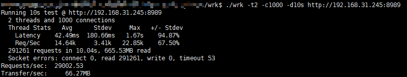

# hpms
### 基于C/lua实现的服务器
[项目介绍](http://139.199.203.157:6002 "点击访问")。

## 项目架构


## 编译
```
git submodule init
make linux
```
## 运行
```
// server
hpms example/echo-srv.lua
// client
hpms example/echo-cli.lua
```

## 性能测试
    下图均为本地测试结果

